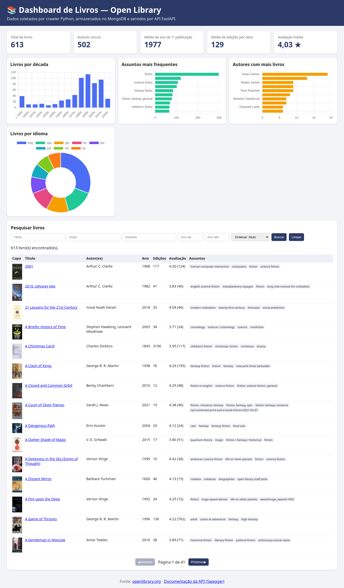

# 📚 Open Library — Crawler + MongoDB + FastAPI + Dashboard

Projeto universitário que implementa um pipeline completo de dados:

```
openlibrary.org  →  Crawler Python  →  MongoDB  →  API FastAPI  →  Dashboard Web (Chart.js)
```

## 1. Site escolhido e dados coletados

**Open Library** (<https://openlibrary.org>) é um catálogo aberto de livros mantido pelo Internet Archive.
O crawler acessa o endpoint público `https://openlibrary.org/search.json?subject=<assunto>&page=<n>&limit=<k>`
para os assuntos (padrão) **fiction, science, history, fantasy, romance, programming**, com paginação.

Boas práticas de coleta: `User-Agent` identificado, intervalo configurável entre requisições
(`--atraso`, padrão 1,5 s), novas tentativas com espera crescente em caso de erro e solicitação apenas dos campos necessários (`fields=`).

Campos extraídos de cada obra: título, autores, ano da 1ª publicação, assuntos, idiomas, editoras,
quantidade de edições, mediana de páginas, avaliação média e nº de avaliações, id da capa, chave/URL da obra.

Limpeza/normalização: remoção de espaços extras, listas sem itens vazios ou duplicados (case-insensitive),
assuntos e idiomas em minúsculas, assuntos limitados a 25 e editoras a 10, anos inválidos (≤ 0 ou futuros) viram `null`,
avaliação arredondada para 2 casas, registros sem chave ou título descartados.

Duplicatas: índice **único** em `chave` + **upsert** (`UpdateOne(..., upsert=True)`). Novas execuções
atualizam/acrescentam documentos e **nunca apagam** dados anteriores.

## 2. Estrutura do projeto

```
openlibrary-projeto/
├── crawler/openlibrary_crawler.py   # Crawler (independente da API), com CLI
├── database/conexao.py              # Persistência: conexão, índices, upsert
├── api/main.py                      # API FastAPI (+ mount estático do dashboard)
├── dashboard/                       # index.html, app.js, estilo.css (consome só a API)
├── docs/dashboard.png               # Captura de tela do dashboard
├── docs/screenshot.py               # Script que gera a captura (Playwright)
├── docker-compose.yml               # MongoDB 7 em container
├── requirements.txt
└── .env.example
```

## 3. Instalação

Pré-requisitos: Python 3.10+ e MongoDB (Docker ou local).

```bash
python -m venv .venv
source .venv/bin/activate          # Windows: .venv\Scripts\activate
pip install -r requirements.txt
cp .env.example .env               # ajuste MONGO_URI se necessário
```

### MongoDB
- **Docker:** `docker compose up -d` (porta 27017, volume persistente `mongo_data`).
- **Local:** instale o MongoDB Community e inicie `mongod` (ex.: `mongod --dbpath ./dados`).

## 4. Execução

```bash
# 1) Coleta (padrão: 6 assuntos × 2 páginas × 50 itens)
python -m crawler.openlibrary_crawler
# Exemplos com argumentos:
python -m crawler.openlibrary_crawler --assuntos fiction poetry --paginas 3 --limite 100 --atraso 2

# 2) API
uvicorn api.main:app --reload --port 8000
#    Swagger:   http://localhost:8000/docs
#    Dashboard: http://localhost:8000/dashboard/   (ou http://localhost:8000/)
```

O dashboard também pode ser servido por qualquer servidor estático, ex.:
`python -m http.server 5500 -d dashboard` → <http://localhost:5500> (ele chama a API em `http://localhost:8000`; CORS liberado).

## 5. Estrutura do documento (coleção `openlibrary.livros`)

| Campo | Tipo | Descrição |
|---|---|---|
| `_id` | ObjectId | Id gerado pelo MongoDB |
| `chave` | string (único) | Chave da obra na Open Library, ex. `/works/OL27513W` |
| `titulo` | string | Título |
| `autores` | [string] | Nomes dos autores |
| `ano_primeira_publicacao` | int \| null | Ano da 1ª publicação |
| `assuntos` | [string] | Assuntos (minúsculas, até 25) |
| `idiomas` | [string] | Códigos de idioma (ex. `eng`, `por`) |
| `editoras` | [string] | Até 10 editoras |
| `qtd_edicoes` | int | Número de edições |
| `paginas_mediana` | int \| null | Mediana do nº de páginas |
| `avaliacao_media` | float \| null | Nota média (1–5) |
| `qtd_avaliacoes` | int | Quantidade de avaliações |
| `capa_id` / `capa_url` | int / string | Capa (covers.openlibrary.org) |
| `url` | string | Página da obra |
| `fonte_url` | string | URL exata da requisição que trouxe o registro |
| `origem` | string | `openlibrary.org` |
| `assuntos_buscados` | [string] | Assuntos pelos quais a obra foi coletada (acumulativo) |
| `coletado_em` | datetime (UTC) | Data/hora da última coleta |
| `primeira_coleta_em` | datetime (UTC) | Data/hora da primeira coleta |

Exemplo:
```json
{
  "chave": "/works/OL27513W", "titulo": "The Fellowship of the Ring",
  "autores": ["J.R.R. Tolkien"], "ano_primeira_publicacao": 1954,
  "assuntos": ["elves", "dwarves", "fantasy", "..."], "idiomas": ["eng", "por", "..."],
  "qtd_edicoes": 300, "avaliacao_media": 4.4, "qtd_avaliacoes": 500, "capa_id": 14627509,
  "url": "https://openlibrary.org/works/OL27513W",
  "fonte_url": "https://openlibrary.org/search.json?subject=fantasy&page=1&limit=50&fields=...",
  "origem": "openlibrary.org", "assuntos_buscados": ["fantasy", "fiction"],
  "coletado_em": "2026-10-07T12:39:34Z"
}
```
Índices: `uk_chave` (único), `titulo`, `autores`, `assuntos`, `ano_primeira_publicacao`.

## 6. Endpoints da API

| Método | Rota | Descrição |
|---|---|---|
| GET | `/api/saude` | Status e total de registros |
| GET | `/api/livros` | Lista paginada. Parâmetros: `pagina`, `por_pagina` (≤100), `titulo`, `autor`, `assunto`, `idioma`, `ano_min`, `ano_max`, `q` (busca livre), `ordenar` (`titulo`, `ano_primeira_publicacao`, `qtd_edicoes`, `avaliacao_media`, `coletado_em`), `ordem` (`asc`/`desc`) |
| GET | `/api/livros/{id}` | Livro pelo ObjectId |
| GET | `/api/livros/chave/{olid}` | Livro pela chave da obra (ex. `OL27513W`) |
| GET | `/api/estatisticas` | Totais, autores únicos, médias (ano, edições, avaliação), anos mín./máx., última coleta |
| GET | `/api/estatisticas/autores?limite=10` | Top autores |
| GET | `/api/estatisticas/assuntos?limite=10` | Top assuntos |
| GET | `/api/estatisticas/idiomas?limite=10` | Livros por idioma |
| GET | `/api/estatisticas/decadas?desde=1800` | Livros por década (anteriores agrupadas em `< desde`) |
| GET | `/api/estatisticas/assuntos-buscados` | Livros por assunto de coleta |

Resposta de `/api/livros`: `{ "total", "pagina", "por_pagina", "total_paginas", "itens": [...] }`.
Documentação interativa: **/docs** (Swagger) e **/redoc**.

## 7. Dashboard

Indicadores: total de livros, autores únicos, média do ano de 1ª publicação, média de edições e avaliação média.
Gráficos: livros por década, assuntos mais frequentes, autores com mais livros e livros por idioma.
Pesquisa por título, autor, assunto e intervalo de anos, ordenação e tabela paginada com capas.
Todos os dados vêm de chamadas `fetch` à API.



## 8. Resultado do teste realizado

Execução real (07/10/2026): 6 assuntos × 2 páginas × 50 → 600 lidos, 573 obras únicas; nova execução de `fiction` (3 páginas)
→ 40 novas e 110 atualizadas, total **613** documentos, sem duplicatas. 502 autores únicos, ano médio ≈ 1977, média de 129 edições/obra.
